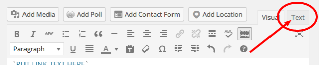
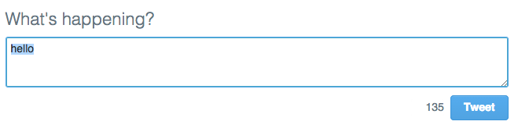
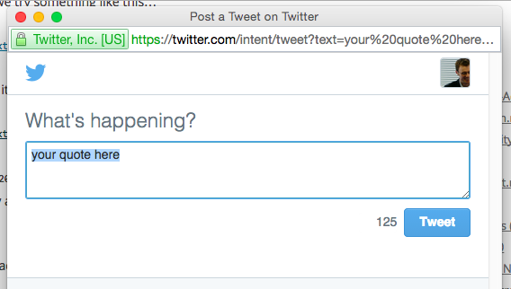

# Introduction

In this series of tutorials I'm going to introduce you to some basic HTML by showing you a particularly useful application of simple coding skills: making something in your article 'tweetable'.

I'll do this in three stages: the first and longest part will introduce HTML basics by showing how to create the **'tweetable quote'**; the second part will add more details on **tweeting links, hashtags and @names**; and finally, the third part will add a little **design flair** with CSS.

**You will need an article already written** in order to do this - ideally one with at least one image, and some good quotes.

# Stage 1: The tweetable quote

If you know how to create a link then you already know how to create a tweetable quote.

Let me explain. A link has two parts:

1. The raw text or image which is linked, and
2. The **HTML code** which makes it into a link. HTML code is always in triangular brackets, sometimes called **chevrons**.

Here, for example, is a link with both elements:

`<a href="http://onlinejournalismblog.com">PUT LINK TEXT HERE</a>`

The text (in capitals in the example above) will go to the link in quotation marks in the HTML, **whatever that text is**.

Now let me show you the HTML for a link which creates a very simple 'tweet this' box with the tweet already filled with the text 'hello'. The structure is the same:

`<a href="https://twitter.com/intent/tweet?text=hello">PUT LINK TEXT HERE</a>`

## Starting with HTML: opening and closing tags

In Wordpress, switch from the normal 'Visual' view to the 'Text' view, which allows you to see the post text including most of the HTML as well.

For example, if you have any formatting such as bold or italic text, subheadings, bullet or numbered lists and links, then you should be able to see the HTML doing that work. Here are some examples:

* `<strong>` - this makes text bold
* `<em>` - this makes text italic
* `<h2>` - this makes a Heading 2 subheading. Similar tags will create headings at levels 3 down to 6
* `<ul>` - this makes a bullet list...
* `<li>` - ...and then the first item in that list
* `<ol><li>` - this makes a numbered list, and then the first item in that list
* `<blockquote>` - this makes an indented quote
* `` - this makes an image
* `<a>` - this makes a link. More on this later.

You should also notice that (almost) every tag has a similar, tag, with a backslash before it.

This 'turns off' the tag. For instance:

* `</strong>` - this turns off bold text
* `</em>` - this turns off italic text
* `</h2>` - this ends the Heading 2 subheading.
* `</ul>` - this marks the end of a bullet list...
* `</li>` - ...and this marks the end of the first item in that list
* `</li></ol>` - this ends the last item in a numbered list, and then the numbered list as a whole
* `</blockquote>` - this ends an indented quote
* `</a>` - this marks the end of linked text.

You'll notice one tag that is only in one of those two lists: ``. This is because the `img` tag is one of a very few tags that don't have a closing tag.

All this is a long way of saying: **if you want to create a link, you need to make sure that you close it with the `</a>` tag**.

You may have noticed that the `<a>` in the link code example given earlier also includes other words like `href=` - why don't we close those? Well, because those are not tags - they are something else, as I'll explain next.

As a first exercise, before that, try this:

1. Make sure you are in the HTML view for your post (click the Text tab if you are in Wordpress).
2. Find a quote (try CTRL+F to find it quickly)
3. Put `<a>` immediately before it (on the same line) and `</a>` immediately after it (also on the same line).
4. Preview the post after this change. The quote should now be coloured like a link: it will look blue (or whatever your site's theme uses to indicate links) but it will not be underlined. And when you hover over it, you cannot click - why?

### Attributes and values

Some HTML tags, like `<a>` and `` need **attributes and values** to work properly. You can create some HTML which looks like this: `<a>A LINK</a>` and it will look like a link - but it won't go anywhere. Why? Because we haven't specified *where we want the link to go*.

The source of the link is just one **attribute** that an `<a>` tag can have. That attribute is `href` (hyperlink reference).

Other common attributes of tags include `src` (source), `width`, `height`, `color` and `border`. And when you start to think about those the idea of an attribute makes more sense: if you want to draw a box then of course you need to know its attributes in terms of width and height.

And of course each attribute needs a **value**: what *is* the width? What *is* the height, or the colour? What *is* the URL of the `href` of this link, or `src` of this image?

The value is specified by adding an equals operator after the attribute, and then the value in straight quotation marks.

A typical `<a>` tag in full, then, with an **attribute and its value**, looks something like this: `<a href="http://onlinejournalismblog.com">`

The `href` **attribute** has (`=`) the **value** `"http://onlinejournalismblog.com"`

**A single tag can have multiple attributes**. An image can have a `src` attribute, a width and height, a border thickness, alignment, title and alternative description, to name just a few.

But you **only close the tag**. You do not close the attributes.

To apply these principles to your link, change the HTML so that the `<a>` tag has an `href` attribute like so:

`<a href="">`

Make sure there is still an `</a>` after the text, to end the link. 

Now when you preview to see the effect of the change, your text should not only be styled like a link, but it should be clickable too, <a href="">like this</a>.

But when you click on the link, it will not go anywhere.

That is because you now have a tag and an attribute, but **no value** (the URL of the link it should be going to).

So let's add one. The URL which will create your tweet:

`https://twitter.com/intent/tweet?text=hello`

If you add this as your `href` attribute's *value* your full link HTML should look like this:

`<a href="https://twitter.com/intent/tweet?text=hello">Your link text here</a>`

Change your HTML for the link so it uses the same URL. Then **preview and test the link** (you need to be logged into Twitter by the way, or you'll be taken to a login page). 

The link should open a Twitter box with the word 'hello' already entered. 

Now ideally we want it to open in a *separate* window. And there's an attribute for that: `target`.

The `target` attribute specifies whether you want this link to open in the same window, or a new one (among other now largely unused options). 

If you *don't* use it, the link will by default open in the same window. But if you want to open in a *new* window, then you need to give the `target` attribute the value `="_blank"`. Here's an example of adding that to the link shown above:

`<a href="https://twitter.com/intent/tweet?text=hello" target="_blank">PUT LINK TEXT HERE</a>`

Now preview and test the link. 

T> **Regular testing is key when playing with any code**: it allows you to identify any problems quickly and specifically. 
T> 
T> For example, if you make ten changes and *then* test, the cause of any problem could be *any* of those ten changes. If for each of those ten changes you test *each time*, you will only get that problem for the *one* change that causes it.

## Customising the tweeted text: hackable URLs

When you click on that text you'll notice that the resulting window contains the impressive but ultimately unhelpful text: 'hello'.

Now we want to change that text to the same text as our quote.

If you look at the URL you should be able to guess how to do that. 

At the end of the URL are the words `text=hello`. This is very similar to the attributes and values that we talked about: `text` always stays the same (it means the contents of the tweet) but the value can be changed. At the moment that value is `'hello'` but... what if we change it?

Well, we can **try and see what happens**. It's not going to break the internet.

So, change the value to something else to test our suspicions: is this the part of the URL which populates the text of the tweet? 

**In your browser address bar**, then, copy and edit that URL to this:

`https://twitter.com/intent/tweet?text=goodbye`

And yes indeed when we go to that URL the text changes to 'goodbye'.

This is called a '**hackable URL**'. In other words, we can change ('hack') the URL to generate different results.

How about a longer phrase? When we try something like this...

`https://twitter.com/intent/tweet?text=your quote here`

...it works, but look at the final URL: it's slightly different:

`https://twitter.com/intent/tweet?text=your%20quote%20here`

The spaces have been replaced by `%20` - because URLs cannot have spaces in them (in Firefox it may look like spaces, but if you copy and paste the URL into a text editor you will see %20 instead). 

This is called **'escaping'** special characters which might otherwise cause problems, and your browser automatically does it.

Try it now, then, with the quote you actually want to appear in the tweet. Ideally you should copy the resulting URL with `%20` instead of spaces - although if you didn't the link would probably still work (**'resolve'**) anyway.

Now use that in your HTML link instead of the simpler 'hello' version so you have something like this:

`<a href="https://twitter.com/intent/tweet?text=How%20to%20create%20a%20tweetable%20quote %20by%20Paul%20Bradshaw" target="_blank">How to create a tweetable quote by Paul Bradshaw</a>`

By the way, speech marks are another special character which needs to be 'escaped'. In this case, it will be replaced by `%22`.	

When someone clicks on that link it should open a new window containing the text specified.

Have a play with the techniques covered so far until you're confident. In particular, see if you can add a short link back to the original post.

**In the next part** I will outline how to add that link, plus other elements such as @names and hashtags.

Before then, let's cover a bit more on HTML: specifically *nested* tags.

## Changing your linked text to a 'call to action'

So far we've been linking the quote itself, but will the user know what will happen when they click on it? Chances are the user will assume that link takes them to the source of the quote - not to a Twitter box allowing them to share it.

So we need to change that.

First, we need to create the 'Call to Action' (CTA) that tells the user to 'Tweet this!'. Type that after the quote, perhaps in square brackets, like so:

> [Tweet this!]

Now we need to link *that* text instead of the quote itself. You could, for example, cut and paste both parts of the `<a>` tag (opening and closing) from where they were, to before and after *[Tweet this!]*.

If you want that text to be a bit less obtrusive, you can make it 'superscript' (small text hovering slightly above normal text) with the `` tag like so: <a href="https://twitter.com/intent/tweet?text=hello" target="_blank">[Tweet this!]</a>

`<a href="https://twitter.com/intent/tweet?text=hello" target="_blank">[Tweet this!]</a>`

### Which tag comes first?

At this point you are dealing with a piece of HTML which uses *two* tags: `<a>` and ``. 

This is a good opportunity to introduce the **LIFO rule** in HTML: **when you are combining more than one tag, they should be closed in the reverse order**. 

In other words: **Last In First Out** (LIFO).

If you want text to be bold *and* italic, for example, you could apply that formatting by combining the tags: 

`<strong><em>` 

...then close in the reverse order: 

`</em></strong>`

It does not generally matter which one comes first; it only matters that you reverse the order when closing. So conversely, if you started with

`<em><strong>` 

...then you would close with 

`</strong></em>`

In some cases, however, you don't have that option. 

For example in a bullet or numbered list you have to open a tag for the list as a whole *and* for *each* item within that list. You cannot open a list item before you open the list in which it is supposed to sit. 

So, you only use `<ul>` (unordered list) and `</ul>` once (because there is only one list) but within those you might use `<li>` (list item) and `</li>` as many times as you want bulleted *items*.

If you get any problems with tags it is worth checking:

1. Whether you closed them in the reverse order, and 
2. If you change the order, does it help?

For example, if you have problems with `<a>`, try `<a>` - but always remember the LIFO rule: whichever tag you open first - `` or `<a>` - should be the one you close last.</a> <a href="https://twitter.com/intent/tweet?text=whichever%20tag%20you%20open%20first%20should%20be%20the%20one%20you%20close%20last&url=http://bit.ly/1wYDlRK" target="_blank">[Tweet this!]</a>

## Adding a Twitter icon

The same principle applies if you want to use a little Twitter bird icon after your quote. 

There are a number of these on [Twitter's image resources page](https://dev.twitter.com/overview/general/image-resources) including this one:

In this case your HTML looks like so:

``

This time the `` tag is nested within the `<a>` and `</a>` tags. We can't reverse this order because `` does not have a closing tag. We link the image by surrounding it with the opening and closing `<a>` tags.

The `` tag also has some attributes: `src=""` tells us where the image is being loaded from: in this case `https://g.twimg.com/dev/documentation/image/Twitter_logo_blue_16.png`

And the `alt=""` attribute tells us an alternative description for the image, in case the user is using screen reading software (because they are partially sighted or blind), or if the image does not load, and also to help search engines understand what the image is. 

For more styling options see the final part of this series on using CSS.

Have a play around with making your own 'tweet this' links and different URLs. In the next part I'll cover how to add other elements to the tweet itself.
