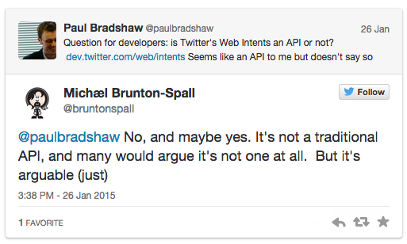

# Stage 2: Adding links, hashtags and @names to a 'tweet this' window

You *can* add a link into your tweet just as you would any other word, for example:

`https://twitter.com/intent/tweet?text=hello%20http://bit.ly/12345`

But there's another option: using this: 

`&url=`

Here's how it looks:

`https://twitter.com/intent/tweet?text=hello&url=http://bit.ly/12345`

You can also add hashtags using this:

`&hashtags=`

...like so:

`https://twitter.com/intent/tweet?text=hello&url=http://bit.ly/12345&hashtags=journalism`

And you can credit a Twitter username using this:

`&via=`

...like so:

`https://twitter.com/intent/tweet?text=hello&url=http://bit.ly/12345&via=paulbradshaw`

So we have **text=, url=, hashtags=**, and **via=**. Does it matter what order they come in? My answer would be 'Try changing it, and see'...

...And you'll find that no, it doesn't matter. What does matter is that you put an ampersand between each pair, like so:

**url=**http://bitly.com/hellothere

**&text=**hello%20there

**&via=**paulbradshaw

**&hashtags=**journalism

What's happening here? Well, you're actually using a special part of Twitter called **Web Intents**. This is sort-of-an **API** (Application Programming Interface)...

## An introduction to APIs

Firstly, what is an API? **An API essentially makes it easier for computer scripts to communicate with each other**, and automate actions. In this case, tweeting or retweeting text, links, images and other material.

For example, as long as a developer knows the structure of the URL, they can write scripts which automatically generate a 'tweet this' or 'retweet this' link. That saves a lot of time, yes?

In this case, it has made it easier for you to manually do the same thing: generate a 'tweet this' window pre-populated with certain text, links, hashtags and @names.

### APIs and documentation

Like most APIs, [Web Intents comes with pages of **documentation**](https://dev.twitter.com/web/intents) explaining how it can be used.

The [main page for this](https://twitter.com/intent/tweet) explains, for example that our URL is for a tweet:

`https://twitter.com/intent/tweet`

But you can also form a URL for a retweet - `https://twitter.com/intent/retweet` - or to favourite a tweet: `https://twitter.com/intent/favorite`. I'm not going to cover that here, but if you want to take this further it's worth exploring the documentation for those.

Instead, drilling down further into [the specific documentation for the 'tweet' options ](https://dev.twitter.com/web/tweet-button/web-intent) you'll find a section named 'Query parameters'.

And here, finally, we start to see those words we were putting into our URL: `text`, `via`, `url`, `hashtags`, plus a couple more: `related` and `in-reply-to`.

### API parameters

**'Query parameters'** are types of **questions you can ask** of an API.

In many APIs you can ask a question - form a query - and get information back: for example one query parameter might be 'postcode=', and then you supply a value with that. In return, you get information about the postcode you supplied. (This is what the [UK-Postcodes API](http://www.uk-postcodes.com/api) does.)

In the case of Twitter's Web Intents, what you get 'back' is that tweet box populated with the values you've supplied.

The query parameter `in-reply-to` can even add some **metadata** to the tweet which connects it to a specified other tweet.

Each parameter is followed by an equals sign and the value - as we've already seen. So an example of using the `text` query parameter is `text=hello`.

And each pair of query parameters (`text=`) and values (`hello`) is separated with an ampersand like so:
<pre>text=hello&url=http://bit.ly/12345&via=paulbradshaw</pre>
You can have a play around with various combinations of queries and see what happens. Again, you're not going to break the Internet. Now you have a little bit of API experience to build on.

In the third part I'll take a detour into a little hack I discovered which allows you to **embed images in a tweet**. Then in the final part I'll cover how to style your tweetable quotes further, and start to explore **CSS**.
