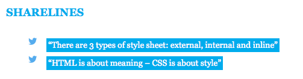
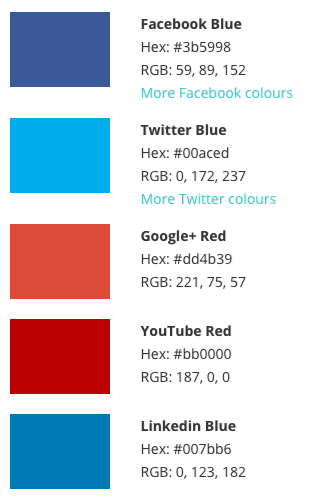

# Stage 3: Styling your 'Tweet this' quotes with CSS

The image above shows a 'Sharelines' section with quotes in white text against a blue background, each one preceded by a Twitter icon bullet point.

All of those stylistic elements are created with **CSS**: Cascading Style Sheets. And this part will explain how to learn more about CSS by using them to style your 'tweet this' links.

In order to do that I need to explain how CSS works alongside HTML, and why we need both.

## HTML = content and meaning; CSS = style and design

Because content can be viewed on all sorts of devices - from big desktop screens to laptops, tablets, mobile phones and televisions - it is important to separate **content** from **style**.

While the *content* remains the same, we might choose to *style* it in different ways depending on the device the user is using. 

Some tags in HTML may *sound* like they're about appearance: *heading* tags, for example, or tags that make text *bold or italic*.

But in reality they are about **meaning**: a `<h1>` tag indicates that the heading is of 'first level' importance; a `<h2>` tag indicates a heading which is one level below that; and so on. How we *style* headings of such importance is a separate decision.

Likewise, once upon a time we used the HTML tag `<b>` to make something bold, and `<i>` for italic. But both those tags described *appearance*, so they were replaced with `<strong>` and `<em>` to describe the *emphasis* imbued in the text: again, **meaning, not style**. 

We can style those tags separately using CSS: emphasised text could be styled orange; strongly emphasised text could be made larger.

If you want to specify the colour of text, its background, size, or font, then you should be using CSS to do so. 

And CSS allows us to style all sorts of aspects of a webpage, from borders and alignment to margins and padding, opacity - even the appearance of the cursor or the behaviour of rollovers.

## Three types of CSS

There are three ways of using CSS: 

1. **External** style sheets are saved as separate files which the HTML document then links to.
2. **Internal** style sheets are written inside the HTML document, between the `<head>` and `</head>` tags
3. And **inline** styles are written inside HTML *tags*, using the `style=""` attribute.

Each one has its advantages and disadvantages. 

* External style sheets are most widely used because you only have to write the styles once. As long as all your HTML pages link to it, you can change the style of thousands of pages across a website by just changing that one style sheet. 
* Internal style sheets are typically used where one page needs some of its own specific styles.
* And inline style sheets are used where you need to override any other style sheets when it comes to one particular element. *Or* where you cannot gain access to the parts of a website needed to created internal or external style sheets - which is the case with Wordpress.com-hosted sites.

The style sheets are applied *in that order*: where there are any clashes (for example more than one style sheet specifies the font for normal paragraph text) then the most recently applied style sheet overrides others: an internal style sheet can override an external style sheet; and an inline style can override both. 

But remember: this is done on an element-by-element basis: where there is no conflict, *part* of an external style sheet will still apply.

For example, an external style sheet might specify that links are bold and highlighted orange and anything in a Heading 1 tag is in Arial; but an internal style sheet might override one of those styles that by specifying *on this particular page* links are blue and underlined. And then on *one particular link* an inline style may specify, actually, this link is going to be red. Heading 1 tags are still Arial throughout.

## CSS targets tags, attributes and values

In the first tutorial of this series I introduced HTML tags, attributes and values. These become particularly important when it comes to CSS, because **CSS works by targeting tags** to style anything contained within them.

It can do this in a number of combinations:

* It can **target a single tag**, for example `h1`
* It can target a **combination of tags**, for example `blockquote em`, so that the style only affects text within *both* tags
* It can target tags with a **specified attribute and value**. In fact there are two attributes which are regularly used for styling: `class` and `id`. So a piece of CSS might target `<h2>` headings with a `class="headline"` attribute and value. `Class` and `id` are represented with particular symbols, as I'll explain below.

In external and internal CSS an element is targeted and styled by specifying the tag(s) (*omitting the chevrons*), and any attributes/values. That is then followed by a description of the styles to be applied to those, in curly brackets, like so:

`h1 {  font-size: 18px; }`

The styles are described in pairs: first the property (`font-size` in the example above), then a colon, and then the value of that property (18 pixels in the example), and then a semi-colon to indicate the end of that particular property.

You can apply more than one style, like so:

> `h1 {`
>
>  `background: #00FF00;  `
>
>  `color: #FF0000;`
>
>  `font-size: 18px;`
>
>  `}`
 
These don't need to be on separate lines but it makes it easier to interpret when you or someone else looks at it later. (I'll explain those hashes followed by numbers below).

You can specify combinations of tags by listing them in order:

`blockquote em {  font-size: 18px; }`

You can specify tags with a particular `class` attribute by using the **period** like so:

`h1.headline {  font-size: 18px; }`

In the example above we are styling anything within the tags `<h1 class="headline">` (it doesn't matter if it has other attributes too)

And you specify an `id` attribute by using the **hash symbol**:

`h1#headline {  font-size: 18px; }`

In that example we are styling anything within the tags `<h1 id="headline">`

## Inline styles using the style attribute

Having explained how external and internal style sheets work, I now need to point out that inline styles work slightly differently.

An inline style does not need to target tags or attributes, because it exists *within* the tag itself, and actually *is* an attribute of that tag.

Here's an example:

`STYLED TEXT HERE`

To apply an inline style to a tag you need to add the attribute `style=""`

As values within that attribute you then add as many property:value pairs as you want, each pair separated with a semi-colon.

### Style-specific tags: div and span 

In the example above I've used the `` tag. This is one of two tags which are often used to apply styles to elements which are not contained within any particular HTML tag. 

The other is `
`.

The key difference is this:

* `
` is used for **'block level' elements** - in other words items like paragraphs or larger sections of a page.
* `` is used for smaller elements, such as **individual words or sentences**.

For example the body of an article may be contained within the tags `
` and `
` or each quote is contained within the tags `` and ``. 

### Describing colours: hexadecimal codes

One other thing which needs explaining about the examples above: how to describe colours.

**Colours on the web are created by combining red, green and blue light**: the **RGB model**. 

To paint a colour online, then, you need to specify how much red, how much green, and how much blue your colour is made up of.

This is done with **hexadecimal codes**. These are six characters, preceded by a hash, for example `#000000` or `#FFFFFF` or `#00aced`.

T> Sometimes you might spot a three-character hexadecimal code, like `#FFF` - these are a shorthand way of describing hexadecimal codes which consist of identical pairs: `#000`, then, means the same as `#000000`.

You don't need to know anything more about hexadecimal colours in order to use them: simply type 'hexadecimal codes' into a search engine and you will get dozens of pages which show you colours and their corresponding hexadecimal codes. If you want a specific one, like 'Twitter blue' then search for 'Twitter blue hexadecimal code' (warning: not all sites agree!).

But it's useful to know a little more about how they work, so here's a quick overview...

The first two characters in a hexadecimal code refer to the amount of red; the second two to the amount of green; and the final two characters specify how much blue to use.

The numbers run from 0 to F, which can be a little confusing. Counting from the lowest to highest value, the hexadecimal system looks like this: 

`0, 1, 2, 3, 4, 5, 6, 7, 8, 9, A, B, C, D, E, F`.

To specify 'no green', then, you would start with the characters `00`. To specify '100% green' you would use the characters `FF`

Simple colours, then, can be guessed at like so:

* `#FF0000` - red (100% red, 0% green and blue)
* `#00FF00` - green (0% red, 100% green, 0% blue)
* `#0000FF` - blue (0% red and green, 100% blue)
* `#000000` - black (0% red, green and blue: in other words, no light at all)
* `#FFFFFF` - white (100% red, green and blue) 

Black is `#000000` because that code means precisely 'no light'; white is `#FFFFFF` because, when combined, red, green and blue light makes white light. 

Think of how a prism splits white light into different colours if it helps. This is very different to mixing ink or paint and is worth remembering.

## Applying all this to your tweetable quote

I am going to assume you are using a free content management system like Wordpress.com which does not allow you access to the `<head>` tags. For that reason I'll focus on inline styles.

Pick the quote you want to make tweetable. In the text (HTML) tab, *immediately before* the quote, add the following tag:

``

And immediately after it, close the tag:

``

`#00aced` is the hexadecimal code for a Twitter-like light blue. To make our text stand out against that, we need to make it white: hence the second style: `color: #FFFFFF`

Now, *before the `` tag*, add the HTML for your link which opens a 'tweet this' window populated with the quote and any other elements such as links, hashtags, etc.

Make sure you close `</a>` *after* the closing `` tag too.

Why is it important to apply `` *after* `<a>`? Because **styles are applied in order**: if we apply `span` and then `a`, the style attribute of `span` will be applied but *then* any styles applying to `a` will be applied.

Doing it the other way means that styles for `a` are applied first, and then style attributes of `span`.

### Other things you can change: padding, fonts, size, floating, bullets, rollovers

Try adding padding to your quote - see what happens. Change the amount until you're happy.

`"Your quote here"`

Try changing the font family and size:

`"Your quote here"`

Try 'floating' the quote to the right. 

`"Your quote here"`

Try changing the height and width of the box containing the text:

`"Your quote here"`

And how about that list with little Twitter icons as bullets? 

`<ul><li style="text-indent:2em; list-style:none; background-image:url('https://cdn.cms-twdigitalassets.com/content/dam/developer-twitter/images/Twitter_logo_blue_16.png'); background-repeat:no-repeat">"First tweetable quote"</li></ul>`

The properties being styled here include `text-indent` (indent the text - this is needed because otherwise the text would lie on top of the bullet images), `list-style` (remove the bullets), `background-image` (the URL of the image we want to put behind the text - note that it uses single quotes so as not to conflict with the double quotes around the whole series of property:value pairs) and `background-repeat` (we only want the image to appear once, not repeat).

Unfortunately, because you are styling the tag **you will need to repeat this for each list item**. (Now you can see why internal and external styles are so much more useful: with those you only need to style `li` once.)

Thankfully you can copy and paste the HTML.

If you want to add a fancy rollover effect you can do that too. The code for that would look something like this:

`style="onMouseOver="this.style.backgroundColor='#999999'"` 

`onMouseOut="this.style.backgroundColor='#00aced'"`

If you need to know about any of these properties and how to use them, search for the name of the property and 'CSS'.

Likewise, if you want to find a way to style something in a particular way, just search for what you want to do and the word 'CSS'. There are lots of tutorials and examples out there.

# Taking things further: reverse-engineering someone else's CSS

If you see an example of styling that you like, look at the source HTML and search for the links to their style sheets. 

It's unlikely that they'll be using inline styles, so you'll need to look within the `<head>` tags for `style=`. The link will probably be a '**relative URL**' that starts with `/` (meaning it's relative to that site's base URL (e.g. `nameofsite.com/`) rather than an '**absolute URL**' (which would start with `http://`).

If it is a relative URL try copying it and pasting it at the end of the 'base URL' for that site (make sure you're using a browser like Chrome or Firefox which can handle CSS files). You may need to save it and open it in a text editor to see it properly.

If there is more than one CSS link you may need to check each one to find the one you need. Once again, remember trial and error is part of programming so don't be disheartened: even experienced programmers don't always get things right first time.

From here on it's all about experimentation, trial and error, and checking examples and tutorials for the specific effects that you want to make. But you should not have the basics to build on. Good luck!

