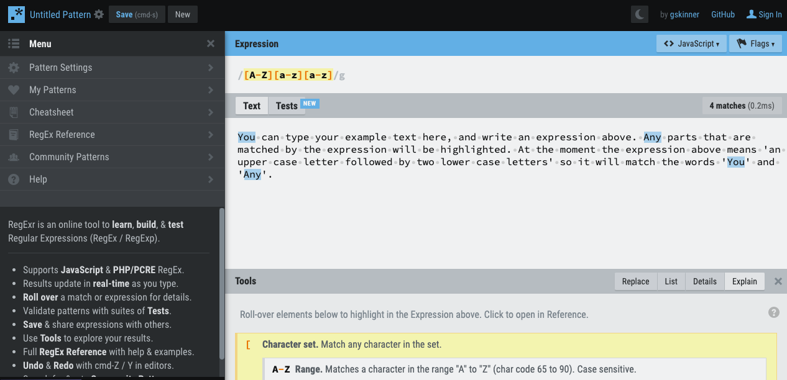
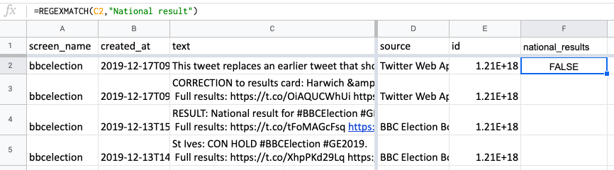
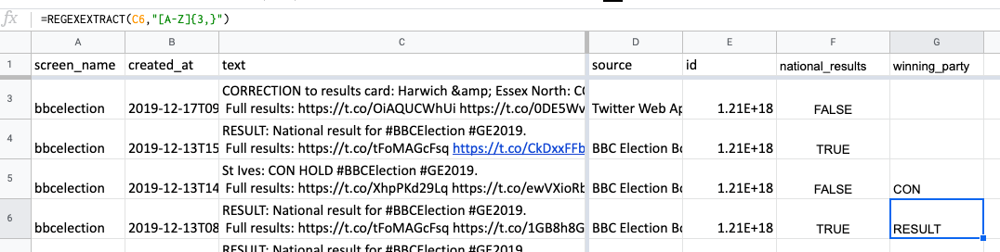
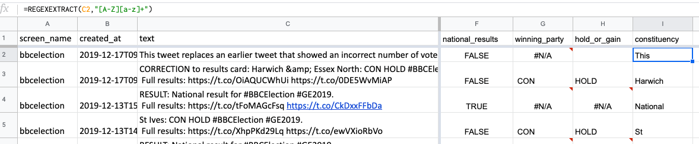
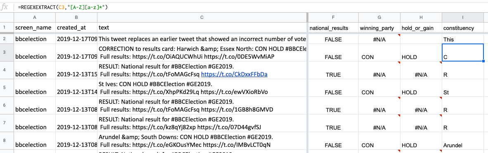
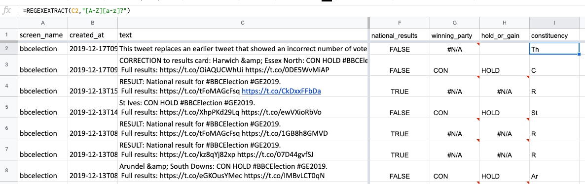
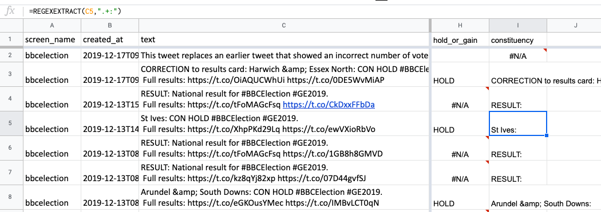
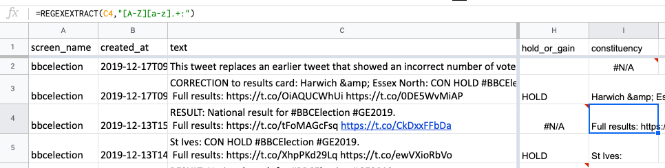
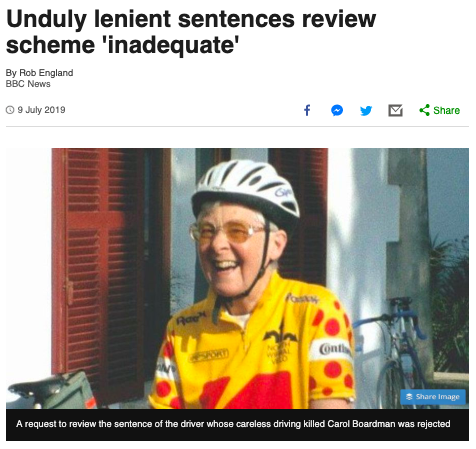

# Extracting text that matches a pattern: regular expressions in Google Sheets

[The story](https://www.bbc.co.uk/news/uk-england-38340015) was an unusual one: the BBC Data Unit had been given access to a dataset on more than 200,000 works of art in galleries across the UK. What patterns could we find in the data that would allow us to tell a story about the nature of the nation's paintings?

Some of the data was straightforward to work with: the 'artist' column was relatively clean, and allowed us to identify the most common male and female artist. It turned out that the latter - the Victorian botanist Marianne North - was relatively unknown. So, that was one story we could tell.

But other parts of the data were more problematic. The date column, for example, contained inconsistently formatted data: in the majority of cases a specific year had been entered, but in many others the data contained text such as "18th century" or "1900-1920" or "1800s".

We also noticed that monarchs featured heavily in the art - but understandably there was no column that was specifically dedicated to classifying those. If we were to identify the most-painted monarchs we would have to create new data that somehow extracted those names from the paintings' titles.

These problems - extracting data from existing data, particular text data - is what **regular expressions** are designed for. In this chapter I will explain what regular expressions are, and how to use them in spreadsheets.

## What are regular expressions

A regular expression is a way of describing a series of characters - they might be key words or phrases, names or addresses, or a code such as a telephone number - that follow a particular pattern.

This is often done in order to extract those collections of characters (for example pulling email addresses out of some data) or replace them (for example removing what you *don't* want).

They are especially useful in *unstructured data* such as free text fields where some sort of description has been entered (e.g. "£300 was spent on food" or "The goal was scored by Marie Smith from 30 yards"), and also for *textual data* where the text has been automated and you want to split it up into its different parts.

Regular expressions are one of the areas where Google Sheets is definitely preferable to using Excel. Although you can technically use regular expressions in Excel, the [process is complicated](https://stackoverflow.com/questions/22542834/how-to-use-regular-expressions-regex-in-microsoft-excel-both-in-cell-and-loops), involving activating special plugins and using scripts of code. Google Sheets, on the other hand, has built-in functions.

## Scenarios when you might use a regular expression

Common uses of regular expressions include:

* Extracting telephone numbers
* Extracting postcodes or ZIP codes or similar codes
* Extracting company registration numbers or invoice codes
* Extracting the names of people or places
* Extracting specific parts of an address, such as the country or street name
* Identifying links, or email addresses, or hashtags, @names etc.
* Identifying amounts of money
* Extracting addresses

Before we get into the technicalities of regular expressions here are a few examples to demonstrate how you might use them.

Firstly, imagine you have a dataset on hockey and you want to tell a story about who created the most shooting opportunities for their team mates. The data contains a line for every shot but there's no column for the person who made the pass that led to the shot. Instead it has a column with a description of what happened.

You look at that column and see that those descriptions are written in a relatively consistent way. Normally it includes a part that says "Receiving a pass from Poppy Singh" or "Following a pass from Eve Hill".

A regular expression would allow you say 'Get me the one or more words that follow "pass from" and start with a capital letter followed by one or more lower case letters'.

In this example you are describing a combination of specific words ('pass from'), character patterns (names start with capital letters), and position (coming after 'pass from').

Here's a second example: you have a column in some data on spending that contains the full address of the company receiving the money. You don't want the full address, however - you want the code that comes at the end of the address (normally called a postcode or ZIP code - or CAP in Italy, CEP in Brazil, PLZ in Germany and Austria, and PIN in India).

Your regular expression this time might say 'Find me any text that has a certain number of capital letters followed by a number, then a space, then a capital letter and two digits' (different countries' postal codes follow different patterns so you would use the description that fit the one being used by your data).

A final example: let's say in the same data there's a column which says how much money was spent, and on what - "£3000 was spent on clothes for the actors".

In this case you might use one regular expression to find the amount of money: it might say something like 'a currency symbol followed by one or more digits'. You might find that there are commas or decimals in the figures that you need to factor into your description as well ('a currency symbol followed by one or more digits and/or commas or periods'). You might use a variation of the same regular expression to grab the thing being bought: 'any text that comes *after* a currency symbol followed by one or more digits', for example.

It's worth pointing out that sometimes the same results can be achieved without resorting to regular expressions. For example, addresses are often separated by commas so using the ['Text to Columns' option](https://support.microsoft.com/en-us/office/split-text-into-different-columns-with-the-convert-text-to-columns-wizard-30b14928-5550-41f5-97ca-7a3e9c363ed7) in Excel (splitting on commas) might split out addresses in the way you need without having to resort to regular expressions.

Likewise if what you want is always at the start or end of a cell then you could use a function like `LEFT` or `RIGHT` to grab it (a more powerful formula might combine this with `SEARCH` or `FIND` to identify how many characters to grab) - or use `SUBSTITUTE` to remove all the text you *don't* want.

## Google's REGEX functions

To actually *form* a regular expression you need to use particular characters in a particular way. This is often called **regex** (a short way of saying 'regular expression').

Google has three functions that use regex:

* [`REGEXEXTRACT`](https://support.google.com/docs/answer/3098244?hl=en-GB) will extract text from a cell if it matches the pattern you describe
* [`REGEXMATCH`](https://support.google.com/docs/answer/3098292) will tell you *if* a cell contains the pattern you describe (`TRUE/FALSE`)
* [`REGEXREPLACE`](https://support.google.com/docs/answer/3098245) will *replace* text that matches the pattern you describe

All take two main ingredients:

1. The cell you want to extract text from, check for text, or replace, and
2. The regular expression describing what you want to extract, check for, and replace

The `REGEXMATCH` function has a third ingredient: what you want to replace the matched text with.

Here's one formula to demonstrate:

`=REGEXMATCH(A2,"hello")`

This looks in cell A2 for the expression "hello". If it finds that anywhere, it will return `TRUE` (that is, the cell where you type this formula will show `TRUE`). If it doesn't, it will return `FALSE`.

Here's another, using a different regex function:

`=REGEXREPLACE(A2,"hello","goodbye")`

In this case, the formula will fetch the contents of cell A2, and replace any parts that match that expression ("hello") with some different text ("goodbye"). So if A2 contained "I said hello to her and she said hello to me" the cell where you typed your formula will (once you've moved out of it) contain "I said goodbye to her and she said goodbye to me"

`=REGEXEXTRACT(A2,"hello")`

If A2 contains the characters "hello" anywhere, then the cell where you wrote the formula will simply say "hello" - in other words, it will have extracted the text matching the expression. If A2 doesn't contain "hello" then we will get an `#N/A` error.

This might not sound very useful - and indeed, it isn't. To really make the best use of this function, we will need to create an expression which is less specific - and that's where the *real* power of regular expressions becomes apparent.

## Regular expressions as a language: regex

In the examples at the start of the chapter I explained some ways in which we might describe a *pattern* of characters ('Find me any text that has a certain number of capital letters followed by a number, then a space, then a capital letter and two digits'). To do this we need a language that can describe those patterns.

**Regex** is that language. It can describe each character *literally*, as in the expression `"hello"`, but it can also use *special* characters, such as brackets, asterisks, dollar signs and others, to be less specific.

**Square brackets**, for example, can be used to mean 'any of these characters'

Here's an example of an expression that does just that:

`[A-Z]`

This means 'any upper case letter'.

To say 'any lower case letter' you would use `[a-z]`. And to say 'any digit' you would use `[0-9]`.

These can be strung together like so:

`[0-9][A-Z][A-Z]`

That expression means 'a number followed by an upper case letter followed by another upper case letter' (one way of describing part of a postcode).

Square brackets can also be used to indicate more specific ranges of characters, e.g. `[aeiou]` to indicate 'any lower case vowel'.

A series of letters or numbers in square brackets can be combined with normal (what is normally called 'literal') letters or numbers to match different variations in spelling, like so:

`[Hh]ello`

In this case the expression is saying 'an upper or lower case H, followed by the characters e, l, l, o in that order'

Here's another example with numbers:

`01[0-9][0-9]`

This expression specifies that the first two numbers should be 0 and 1, followed by two numbers of any value (this might be used to match a UK telephone area code).

We could also adapt the previous expression to read like this:

`0[12][0-9][0-9]`

That would mean 'a zero followed by either 1 or 2, followed by two more numbers' (UK area codes, for example, can begin either '01' or '02': this now accounts for that).

Square brackets are just one of a number of characteristics of regex as a specific language. For example, instead of repeating `[0-9]` nine times to indicate 'nine numbers' you might want to be able to indicate this in another way - and you can. Likewise there are ways to specify a *range*, such as 'three to five numbers' or 'one or more' (we will come onto both of these later).

There are ways of indicating *position* in regex too (whether the text is at the start or end), and negative matches like 'a non-numeric character' or 'non-space character'. But before we get into how to do those things in regex, I want to work through an example of using it in practice.

## Putting this into practice with election tweets

Regex is best understood through playing with it yourself. It is a language that often involves **trial and error** - trying different expressions until you find one that does what you need. For this reason you can find a number of 'regex playgrounds' online that make it easier to try out different expressions against example text and see how they perform.

[RegExr](https://regexr.com/) is one of these playgrounds: in the top part of the page you can type an expression, and in the 'text' box underneath (which you can change to your own text) it will highlight the parts that are matched by the expression. On the left you'll also find a cheatsheet, reference and other resources.

I'm going to demonstrate how to use regex with some tweets from [the @BBCelection Twitter account](https://twitter.com/bbcelection). This is a good dataset to demonstrate regex because the tweets themselves are automated and so follow a predictable pattern that we can effectively reverse engineer with the regex.

You can [dowload the data from this link](https://docs.google.com/spreadsheets/d/e/2PACX-1vSGthRci_vLp_GoQDtV2PuvCIxgrgqwhuA1e5md-lrWAEkSWADxYxTPeWqbcxDdj8W5rxOkPGhwimcg/pub?gid=482820707&single=true&output=csv). It's been simplified to 5 columns:

* The screen name of the account (bbcelection)
* A datestamp: `created_at`
* The text of the tweet
* A 'source': for example, whether the tweet was posted using the Twitter web app, Twitterfeed or the BBC Election Bot
* And the ID number of the tweet

We will only be using one of those columns: the text of each tweet.

First, we need to decide what *pattern* of text we want to match. For that, we need to look at the tweets themselves. What patterns can we identify? And which ones do we want to match (that might be in order to extract matching patterns - or use them to exclude tweets)?

One obvious pattern is that the most recent tweets appear to focus on the overall national result of the election, with text like this: "RESULT: National result for #BBCElection #GE2019. Full results: https://t.co/tFoMAGcFsq https://t.co/CkDxxFFbDa"

Let's decide that we are *not* interested in tweets about the "national result". We can use `REGEXMATCH` to detect tweets that match that pattern, and then filter on those TRUE/FALSE matches.

Give column F a title (in cell F1): "national_results". Underneath, in cell F2, type this formula:

`=REGEXMATCH(C2,"National result")`

This very simple regex - basically, a literal match of the string of characters `"National result"` - will return `FALSE`. That's because C2 doesn't contain that string of characters. Copy that formula down, however, and it should return `TRUE` when it looks in cell C4, C6, C7 and others where that string occurs.

Try changing the formula in cell F4 (where it currently returns `TRUE`) so that the upper case N is now *lower case* like so:

`=REGEXMATCH(C4,"national result")`

The formula should now return `FALSE`. This is because regex is case sensitive: it's looking for 'national result' with a small 'n' and the tweet text in cell C4 contains 'National result' with an upper case 'N'.

It's not important to ask: is the case of that letter important?

If it doesn't matter whether the 'n' is upper or lower case, then our regex should not specify that either.

So let's delete the formulae that we typed before and start again, starting in cell F2, by typing this:

`=REGEXMATCH(C2,"[Nn]ational result")`

...and then copy down the whole column again.

Now we are looking for a match where the 'n' at the start can be either upper or lower case.

That should give us a column full of TRUE and FALSE values that we can use to filter out those tweets that relate to national results (TRUE).

That's a very basic application of regex: one thing it doesn't do, for example, is specify whether any characters come before or after that string `"[Nn]ational result"` (which you normally have to do when using regex in coding). But Google Sheets assumes you are looking *anywhere* in the cell unless you specify otherwise by using special characters.

Now let's move on to another function and explore some more advanced regex.

## Using `REGEXEXTRACT` with more advanced regex

Once again, it's best to start with a piece of text that represents the sort of pattern that you're trying to match. Let's say we are interested in tweets announcing the result in a particular *area*. Those tweets look like this:

> "St Ives: CON HOLD #BBCElection #GE2019. Full results: https://t.co/XhpPKd29Lq https://t.co/ewVXioRbVo"

And this:

> "Colne Valley: CON GAIN FROM LAB #BBCElection #GE2019. Full results: https://t.co/WQ2Cp80wKX https://t.co/onDZ6ff3K0"

What patterns can we pick out that are common to both examples?

I'm going to leave a pause here so you can grab a piece of paper and write some down: see how many patterns you can describe that the two pieces of text have in common.

Think not only about specific words that are the same, but about the use of upper and lower case, punctuation and position (start, end, middle) that are similar, even when the specific words are different.

Have you finished?

OK. Here are some that I can see:

* The first word or words start with an upper case letter followed by lower case letters (what's called [title case or headline case](https://en.wikipedia.org/wiki/Title_case), i.e. the way that the titles or names of things are normally written with the first letter in upper case). That's because they are the names of places, of course.
* That is followed by a colon
* And a space
* We then have a collection of three upper case characters that refer to a political party (e.g. CON for Conservative Party)
* And a space
* Then four upper case characters that refer to the type of result (gain or hold)
* After either a space or more upper case characters, these characters: "#BBCElection #GE2019. Full results: https://t.co/"
* After the start of that link, however, there are a series of alphanumeric characters (both upper and lower case, text and numeric) followed by a space and "https://t.co", then more alphanumeric characters (both upper and lower case, text and numeric)

There's plenty to go on here. In particular it's worth emphasising that spaces are just as important as letters and numbers, and punctuation is important too.

We are going to try to create a column that extracts the party which was announced as the winner of the election in that particular area.

Give column G the name "winning_party"

There's no point testing our formula in cells G2, G3 or G4 because the tweet text in the corresponding cells in column C don't relate to winning parties.

So skip to cell G5, and type this formula:

`=REGEXEXTRACT(C5,"[A-Z]{3}")`

The regex here specifies *three upper case characters*. Or, more specifically, it says "any upper case character: three of them".

### Modifiers in regex

The number in curly brackets - `{3}` - is what's called a **modifier**.

A modifier is a special character in regex that modifies whatever comes before it. Examples include "one or more [of what was described]" and "three [of what was described]".

In this case the modifier `{3}` is modifying `[A-Z]` (any upper case character).

Here are some other modifiers that can be used in regex:

* To specify 'one or more of' use `+`
* To specify 'none or more of' use `*`
* To specify 'zero or one of' use `?`
* To specify a particular range of instances, such as 'between 5 and 10 of' you put the lowest and highest number in curly brackets with a comma like so: `{5,10}`
* To specify a minimum number of instances, such as 'at least 7' you put the number in curly brackets followed by a comma like so: `{7,}`

Of course you could equally write this regex like so:

`=REGEXEXTRACT(C5,"[A-Z][A-Z][A-Z]")`

And that would be fine. The modifier just exists as another way to describe it - as well as a way to more flexibly describe potential variations in length, which we will need later.

Either regex works for our test cell - extracting "CON".

Copy that formula down, however, and you'll find that it extracts "RES" from the tweets that being "RESULT:".

How can we stop that happening?

A very simple way is to add the *space* that comes after "CON" but does *not* come after "RES". A formula in row 6 with that space in it would look like this:

`=REGEXEXTRACT(C6,"[A-Z]{3} ")`

When this formula is used instead, you should see `#N/A` results for the "RESULT:" tweets because it doesn't find a match.

There's one odd exception: in one tweet it extracts "TWL". Here's the tweet:

RESULT: National result for #BBCElection #GE2019. Full results: https://t.co/qE0yxz5TWL https://t.co/kFyHWZXvuJ"

Finding the match is tricky: it's actually from one of the URLs: that random collection of letters and numbers in the first link ends with TWL - and then there is a space.

How can we exclude random matches like this? Well, we might decide that we can just clean those rare issues out later, during data cleaning. But we could expand our regex again.

This time, we can look to the left of the text string we wanted to match: while "CON" is followed by a space to the right, it's also *preceded* by a space to the left.

Some regex to match that would look like this:

`=REGEXEXTRACT(C12," [A-Z]{3} ")`

Using spaces in our regex creates a small problem: we just want the three-letter party symbol, not the spaces around them.

Again, we can just decide to tidy that afterwards - or we can wrap the whole of our formula in a `TRIM` function that [strips out any space at the start and end of a cell](https://exceljet.net/excel-functions/excel-trim-function), like so: `=TRIM(REGEXEXTRACT(C12," [A-Z]{3} "))`

But we will put that to one side for now. Instead, let's ask a question: are all the parties represented by three-letter codes? No. Some parties are actually two character codes: the Liberal Democrats are LD and Sinn Fein is SF.

This is where our modifier becomes especially useful.

We can adjust the expression so it captures *either* a series of two or three upper case letters, like so:

`=REGEXEXTRACT(C5," [A-Z]{2,3} ")`

*(Note that this is the formula in row 5, looking at C5 in that row)*

When copied down, it not only extracts the "CON" text in tweets that contain it, but also, in row 15, "SF" for the party Sinn Fein.

### Using the pipe symbol for 'OR' matches

Now let's try to extract whether the tweet says that a party 'gained' a seat (took it from another party that won in the last election), or held it.

Give column H the title 'hold_or_gain'.

The pattern of text that we want to match is *either* "HOLD" or "GAIN". This allows us to use another special character in regex that means 'or': the pipe symbol, `|`.

Again the text in row 2 doesn't contain what we want to match, so it's quicker to test out our regex in row 3. In cell H3, then, type this formula:

`=REGEXEXTRACT(C3,"HOLD|GAIN")`

The regex here means 'look for the sequence of characters "HOLD" *or* the sequence "GAIN"'. More pipe symbols can be added to increase the number of options. For example we could expand it to look for 'WIN' or 'LOSE' too, like so: `"HOLD|GAIN|WIN|LOSE"`.

Once applied and copied down, the formula should extract either of those words if they exist in the tweet.

If *both* words are in the text, it will grab the *first* match against either of those.

### Using the asterisk, plus and question mark modifiers

We've already used the curly bracket modifier to specify a number of characters. Now let's use the other modifiers: the asterisk, plus and question mark.

Let's say we wanted to extract the name of the place that the result relates to. This comes at the start of the tweet, before the colon.

Names start with a capital letter, then some lower case letters. We know there's only one capital letter, but we don't know how many lower case ones there might be in any particular name.

That lack of certainty can be handled by one of the modifiers, however. If we know there's at least one of a certain character, then we can use the plus sign to mean 'one or more'.

Here's one way to use that for the tweet in row 5:

`=REGEXEXTRACT(C5,"[A-Z][a-z]+")`

This means 'an upper case letter followed by one or more lower case letters'.

In the next empty column, I, try this yourself: call the column 'constituency' (that's what these areas are called) and type `=REGEXEXTRACT(C2,"[A-Z][a-z]+")` in cell I2, underneath the column heading.

When you copy that down a number of cells, this grabs the first word in each tweet that starts with a capital followed by at least one small letter.

At the moment it's only grabbing the first word - so only part of place names with multiple words like 'St Ives'. And it's grabbed some matches that we don't want, too, like 'This' and 'National'.

We can solve those problems as we go, but for now we just want to understand how these modifiers work in practice.

Let's use the other two modifiers to show how they work.

Try changing your regex so that the plus sign is replaced by an asterisk. This means '*none* or more of'.

The formula in cell I2, then, would look like this:

`=REGEXEXTRACT(C2,"[A-Z][a-z]*")`

Now we are asking for 'a capital letter followed by none or more lower case letters'.

When copied down, you'll see that this is still grabbing the first part of place names like 'St' and 'Arundel' but it's only grabbing one letter in the other cells.

That's because in those cells the *first* match for the pattern described is the first word in the tweet: 'CORRECTION' or 'RESULT'. Both those words match the description 'a capital letter followed by none or more lower case letters' - or rather, more specifically, the 'C' and 'R' in those words fits that description: they are each a capital letter followed by *no* lower case letters (remember it can be *either* none or more with this modifier).

This modifier doesn't help us in this expression - but it will come in very useful later.

Now let's try the question mark:

`=REGEXEXTRACT(C2,"[A-Z][a-z]?")`

The question mark means 'none or one of' the specified character(s). So this expression in full means: 'a capital letter followed by none or one lower case letter'.

As with the asterisk, the 'C' and 'R' in the words 'CORRECTION' or 'RESULT' are matched again, because each is a capital letter followed by *no* lower case letters.

But in words like 'This' and 'Arundel' the regex only matches 'Th' or 'Ar': the capital followed by *one* lower case letter.

### Matching *any* character: wildcards

So far the best result we've been able to get is to match the first word of any name - but we want to expand that to grab names which have more than one word. "St Ives", for example.

We could change our regex to fit that sort of name - for example by duplicating the first part so it looks like this: `[A-Z][a-z]+ [A-Z][a-z]+`

That would match "St Ives" but it would not match single-word place names, or those with more than two words, such as  "Arundel &amp; South Downs" (the `&amp;`, by the way, is the code for an ampersand - and it doesn't use a capital letter, although we could amend the expression to capture that too).

So we need a different approach.

One useful approach is to look at any characters that appear *after* the words that we want.

In this case, the place name is always followed by a colon. So we could simply ask for 'one or more of any characters followed by a colon'.

There is a special character in regex that means 'any character': it is the period, or dot: `.`.

This is often referred to as a **wildcard**, in the same way that the Joker in a pack of cards can be a 'wildcard' and represent any card in the deck.

Here's an example of an expression which means 'one or more of any characters followed by a colon':

`.+:`

There are only three characters here: the *wildcard* which means 'any character', then the *modifier* to specify that we want 'one or more' of that, and then the *literal* character - the colon - which simply means 'a colon'.

Let's try that in row 5, which is the first tweet that mentions a result in a particular place, by changing the formula to this:

`=REGEXEXTRACT(C5,".+:")`

That works in extracting both words of "St Ives" and the colon that follows them (which we can clean out later).

When copied down the column it also matches "Arundel &amp; South Downs:" - but in some cells it is matching "RESULT:" too, which we don't want.

Now we can start to be more specific in our expression to try to exclude those.

The obvious difference between the "RESULT:" and "St Ives:" is that the former is all upper case whereas the latter uses at least one lower case letter after the initial capital.

We can re-use the regex from earlier to specify this, and incorporate it into our new expression:

`[A-Z][a-z].+:`

Now we are saying: 'An upper case letter followed by a lower case letter followed by one or more of any characters, followed by a colon' (note: this means that any name must be at least three characters long, including spaces, before the colon, so "St" along wouldn't match. If we did think that there might be two-character single-word place names in our data, we could amend the expression to use `*` instead of `+` to mean 'none or more', rather than 'one or more').

When we change our formula to use that expression, and copy it down the column, it now stops matching "RESULT".

However, it does now match another part of the tweets that we don't want: the part that says "Full results:"

We could, once again, filter this out as part of cleaning. But this problem gives us a convenient excuse to explore *another* part of regex...

### Specifying position (start or end)

If we can't distinguish between "St Ives:" and "Full results:" based on their characters, we *can* distinguish between them based on their position: "St Ives" and other names always appear at the *start* of the tweet.

There are two special characters that we can use in regex to specify that we are looking for a pattern in a particular **position**:

* The caret symbol `^` means 'at the start of the text'
* The dollar symbol `$` means 'at the end of the text'

These special characters must be used in a particular position: The caret must be used at the very start of the expression; the dollar must be used at the very end.

With our expression then, we just need to add a caret symbol to the start of our expression to specify that we only want to bring back matches where that pattern occurs at the very start of the tweet:

`^[A-Z][a-z].+:`

When we adjust our formulae to include that caret symbol the results should now stop fetching "Full results:" because that series of characters doesn't appear at the start of each tweet (instead those matches should now change to `#N/A` errors, indicating it has failed to find a match, which is what we want).

A> If you want to try out the dollar sign as well you could use it to fetch the second link, which always appears at the end of the tweet.
A>
A> One way to write an expression to fetch this would be `http.+$` - that would actually grab both links because it would start with the first match and go all the way to the end.
A>
A> If you wanted to only grab the second link you could expand the expression to: `[A-Za-z] http.+$`
A>
A> This specifies that there must be a letter and a space before the link. That will exclude the first link, because it's preceded by a *colon* and a space. You will of course need to clean out that character and space later, however.

### 'Escaping' special characters

A final aspect of regex to demonstrate is what to do when you want to match a character which is used as a **special character** in regex. In other words, what if you wanted to match an *actual* dollar sign, or period, or question mark?

The website Regular-Expressions.info [has a helpful page that explains the differences between literal characters and special characters]. "There are 12 characters with special meanings," it says:

> "The backslash `\`, the caret `^`, the dollar sign `$`, the period or dot `.`, the vertical bar or pipe symbol `|`, the question mark `?`, the asterisk or star `*`, the plus sign `+`, the opening parenthesis `(`, the closing parenthesis `)`, the opening square bracket `[`, and the opening curly brace `{`, These special characters are often called "metacharacters". Most of them are errors when used alone."

(Characters not in that list are **literal characters**: that is, they literally refer to themselves: a `c` means 'a lower case c'; a `0` means 'a zero'; and so on.)

If we wanted to look for a pattern of characters that included one or more *special* characters, then, we need a way to specify that we *don't* want them to be treated as a special character.

This is called '**escaping**' a special character.

In regex you escape a special character by putting a **backslash** before it. So, for example, if we wanted to match an asterisk, we would write `\*`.

As it happens, the only special character in the tweets that we've been using is a period (`.`), also known as a full stop or dot. That's perhaps the most likely special character that you might want to match literally.

In the case of the tweets the period is actually quite a useful character to focus on: it separates the first part of the tweet containing the result, and the second part of the tweet containing a generic "Full results:" link.

If we wanted to use regex to grab that first part of the tweet from each cell, then, we could use this expression:

`.*\.`

This expression uses the period character both as a *special* character (to mean 'any character') and as a *literal* character (to mean 'a period').

There's a lot going on here in just four characters, too. It starts with that period to mean 'any character', followed by an asterisk - a modifier - to mean 'none or more of'. Next comes a backslash to mean 'escape the character that follows', and a period which this time - because of that backslash - literally means 'a period'.

In fact, it's better to see it as *two pairs* of two characters rather than four separate characters: The period and asterisk ('none or more of any character'); and the backslash and period ('a period, literally').

Taken together, those two pairs of characters equate to the expression 'none or more of any character, followed by a full stop'.

Here are some more examples of special characters being escaped in order to create a literal match. See if you can translate the pattern that they are describing - and identify a type of information that that pattern might be used for.

* `\$[0-9]+`
* `\$[0-9]+\.*[0-9]*`
* `\(.*\)`
* `\[.*\]`
* `'.*\?'`

Stop here if you want to spend some time decoding those expressions.

Once you're happy to continue, here are the translations:

The first expression is `\$[0-9]+` - this means 'a dollar sign, followed by one or more numbers'. The dollar sign is escaped, so that it's treated literally, rather than as a special character, and the plus sign modifies the `[0-9]` so it looks for one or more of those digits.

Why might we use this? To match amounts of money being mentioned in a cell. For example if it was used against the text "The purchase cost was $40", it would match '$40'.

However, if it was used against the text "The purchase cost was $40.50", it would still only match '$40' - not the '.50' part of the cost, because we didn't anticipate a period (decimal point) being in the number.

That takes us on to the second expression: `\$[0-9]+\.*[0-9]*` - this is an extension of the previous expression so that it now means 'a dollar sign, followed by one or more numbers, followed by none or more periods, followed by none or more numbers'.

The dollar sign is again escaped, so that it's treated literally, and the period is also escaped for the same reason. The period is also *modified* with the asterisk to mean 'none or more' because some prices might not have a period at all.

This creates a triple-character expression that's worth looking at separately: `\.*` (literally a period, and none or more of those). In fact we might instead write it as `\.?` to mean 'literally a period, none or one of those' because we wouldn't expect more than one period in an amount of money.

Notice that the final part of the expression - `[0-9]*` also uses the asterisk with the digits to specify that we mean 'none or more' of those numbers. This is, again, because while a figure like $40.50 has a period and some numbers after that, a figure like $4 has no period and only one number in total so using `[0-9]+` twice (two instances of at least one number) in the same expression would not match that.

Working through these 'what if?' situations is useful for testing any expression, and it is worth building this into your process.

The next expression - `\(.*\)` - is relatively straightforward in comparison, although it looks uglier because the backslashes come thick and fast. What this is looking for is 'an opening bracket followed by none or more of any character, followed by a closing bracket'. Both the opening bracket and closing bracket character are escaped, so that it will literally look for those.

In other words, it will grab the contents of any brackets, and the brackets surrounding those.

The expression `\[.*\]` does exactly the same, but for square brackets: 'an opening square bracket followed by none or more of any character, followed by a closing square bracket'.

Finally, the expression `'.*\?'` means 'an apostrophe, followed by none or any character, followed by a question mark, followed by another apostrophe'. This is the sort of expression that might match a question in the middle of text. For example, in the text "He asked: 'When will the project be complete?'" this expression will match "'When will the project be complete?'".

The question mark is the character being escaped here. But it's also worth pointing out that the apostrophe in this expression would also match apostrophes in words like "can't" or "company's".

A> Quotation marks can be used as literal characters in regular expressions - but to use them in Google Sheets formulae is a little tricky. This is because the Google Sheets function uses quotation marks to indicate the start and end of the expression, so any quotation mark after the opening quotation mark will be treated as indicating the *end* of the expression, rather than part of it.
A>
A> There are a couple of ways to get around this problem. The first is to put the quotation mark inside another quotation mark, like so: `=REGEXEXTRACT(A7,""".*\?""")`
A>
A> The second is to use the `CHAR()` function to generate the quotation mark - just as we did in the chapter on cleaning dirty data. The `CHAR()` function [just needs one ingredient](https://support.google.com/docs/answer/3094120?hl=en-GB): the "number of the character to look up from the current Unicode table". The Unicode number of a quotation mark is 34, so typing `CHAR(34)` will generate a quotation mark. This can be nested inside the `REGEXEXTRACT` function and combined with a partial expression using the `&` in a formula like so: `=REGEXEXTRACT(A8,CHAR(34)&".*\?"&CHAR(34))`

### Indicating symbols, spaces, line returns and other character types

In addition to 'escaping' special characters, the backslash can also be used with certain letters to indicate other types of characters. Here are some examples:

* `\w` will match any lowercase *or* uppercase character, *or* number, or underscores
* `\W` will match any character that's *not* lowercase *or* uppercase, *not* a number or underscore
* `\d` will match any number
* `\D` will match any character that's *not* a number
* `\s` will match any 'whitespace' character: those include spaces but also a tab character, carriage return, or new line - in other words characters that aren't 'visible' in the sense of using ink if they were to be printed
* `\S` will match anything that is *not* a 'whitespace' character
* `\b` will - when combined with one or more characters - match those characters at the start, or end, of a word. For example `\bBEL` will look for 'BEL' at the start of a word, while `BEL\b` will look for 'BEL' at the end of a word (so the former will match 'BELT' but not 'BABEL' and the latter will match 'BABEL' but not 'BELT')
* `\B` will - when combined with one or more characters - match where those characters *not* at the start, or end, of a word. For example `\Blet` will look for 'let' anywhere *except* at the start of a word, while `let\B` will look for 'let' anywhere *except* at the end of a word (so the former will match 'toilet' and 'fletcher' but not 'letter' and the latter will match 'fletcher' and 'letter' but not 'toilet')
* `\n` will match a newline character
* `\r` will match a carriage return character
* `\t` will match a tab character

Some of these can be used as an alternative to those used already: for example `\d` will do the same as `[0-9]` and `\w` is more efficient way of writing `[A-Za-z0-9_]`.

You'll notice that all of these examples also follow a particular pattern: looking for a *positive* match involves using the relevant lower case letter (e.g. `\d` for digits), while looking for a *negative* match ("anything but" something) involves using the upper case equivalent (so, `\D` for 'not' a digit).

Negative matches against particular characters can also be specifies by using the caret symbol `^` inside a pair of square brackets containing the characters you want to *not* match.

So, for example, just as you might use `[A-Z]` to indicate 'any upper case letter', you can add a caret inside those square brackets like so:

`[^A-Z]`

...to indicate 'any letter that's *not* an upper case character'.

Equally, `[^aeiouAEIOU]` would mean 'any letter apart from a vowel' and `[^Z]` would mean 'any letter apart from an upper case Z'.

## How regex was used in the art story

I opened this chapter with a [story about data on more than 200,000 works of art](https://www.bbc.co.uk/news/uk-england-38340015) in galleries across the UK, and how regular expressions would be needed to pick out the patterns in textual data.

In that particular story I used regex not in Google Sheets, but with the programming language R, and it can be very useful if you decide to use coding in your work (you'll find a chapter on regex in coding Python in my book [Scraping for Journalists](https://leanpub.com/scrapingforjournalists), for example).

Here are just some of the ways that regex was used:

Firstly, it was used as part of a process of **date cleaning**:

* In some cases dates included a question mark to indicate that this was an estimate. The side-effect of this was that we couldn't perform numerical calculations like the average year or the most common century. To clean those up we used the regex `"\?"` (note that the question mark is escaped)
* The same applied to centuries (e.g. "19th C"): the regex `"th C"` was used to identify these (further cleaning was used to convert that to a start and end date)
* The regex `"c"` was used to identify 'c' for 'circa' in a similar way
* The regex `"0s"` was used to identify decades (e.g. '1950s')

It was also used to identify variations of royal names:

* The regex `".*Elizabeth I[^A-Za-z].*"` was used to identify Queen Elizabeth I and II. Similar regex was used to identify other royals, e.g. `".*Richard I[^A-Za-z].*"` (these were generated from a list of royals rather than manually typing each one in)
* Similarly, regex like `".*Queen.*|.*Princess.*|.*Empress.*"` was used to identify royal titles
* And `.*Prince[^s].*` was used to identify where 'Prince' occurred, but *not* when followed by an 's' (otherwise it would also match 'Princess')

Note that some of these expressions matched artworks related to items named after royals, such as the 'Prince of Wales' steam engine, or the 'King's Dragoons' army regiment. These could be identified and cleaned in further stages of data analysis.

And finally, it was used to identify schools of art, with the regex `".*[Ss]chool.*"`.

You can find all the code and spreadsheets used in that project in the GitHub repo for the story at https://github.com/BBC-Data-Unit/art-uk.

## Recap

* A regular expression is a way of **describing a series of characters that follow a particular pattern**, typically used to extract or remove key words or phrases, names or addresses from passages or cells containing text
* Regular expressions are often called '**regex**' for short
* Regular expressions **cannot easily be used in Excel**, but can be used in Google Sheets with its functions `REGEXEXTRACT`, `REGEXMATCH` and `REGEXREPLACE`
* `REGEXEXTRACT` will extract text from a cell if it matches the pattern you describe
* `REGEXMATCH` will tell you if a cell contains the pattern you describe (`TRUE/FALSE`)
* `REGEXREPLACE` will replace text that matches the pattern you describe (in the same way as `SUBSTITUTE` does for literal matches)
* Regex can match using both **literal characters** (they represent the character you want to match) and **special characters** (which represent a more general description, such as 'any character' or 'any capital')
* Special characters are also called "**metacharacters**". They include the backslash `\`, the caret `^`, the dollar sign `$`, the period or dot `.`, the vertical bar or pipe symbol `|`, the question mark `?`, the asterisk or star `*`, the plus sign `+`, the opening parenthesis `(`, the closing parenthesis `)`, the opening square bracket `[`, and the opening curly brace `{`
* Special characters can be used on their own or in combination with literal characters to refer to a type of character (such as 'any whitespace character'), a range of characters (such as 'any of these letters'), a quantity of characters (such as '2 numbers'), alternative characters (such as 'this *or* that pattern'), negative matches (such as 'not a whitespace character' or 'not at the end'), or the position of characters
* If you want to use a special character to *literally* mean that character (e.g. a question mark, literally) then you need to **escape** it, by placing a backslash before it
* You can use **regex playgrounds** to experiment with expressions to see which passages of text they match
* **You don't need to memorise regex**: just look up the type of thing you need to do with the word 'regex', e.g. "match a range of characters in regex"

You can [download a Google Sheet which has both the election tweets and further sheets showing example regex here](https://docs.google.com/spreadsheets/d/e/2PACX-1vSGthRci_vLp_GoQDtV2PuvCIxgrgqwhuA1e5md-lrWAEkSWADxYxTPeWqbcxDdj8W5rxOkPGhwimcg/pub?output=xlsx)

## Find the story: unduly lenient sentences

Another story involving text-as-data that the BBC Data Unit worked on was a [story on unduly lenient sentences](https://www.bbc.co.uk/news/uk-47879288). In this case the data journalist didn't use regex functions - instead they used other text extraction functions such as `LEFT` and `SEARCH`.

However, this is a prime candidate for regex too.

The background to the story and all the data is [available on GitHub](https://github.com/BBC-Data-Unit/unduly-lenient-sentences). For the exercise below [download a stripped-back version of the data here](https://docs.google.com/spreadsheets/d/1xVReCLvP8ChnksZzpcEsUmJhuH2gIgaWahf_0ZgFTsA/edit?usp=sharing) and try to do the following:

Column E contains text for the "Original sentence (refined)" (the "refined" bit refers to the fact that this data has been cleaned a little in Open Refine first). Focusing on this column, see if you can:

* Identify patterns in the data that you might match
* Create a new column where you extract the number of days imprisonment in the sentence
* Create a new column where you extract the number of weeks imprisonment in the sentence
* Create a new column where you extract the number of months imprisonment in the sentence
* Create a new column where you extract the number of years imprisonment in the sentence
* Consider any variations in language that might have led to information not being matched. In particular, look out for potential misspellings, differences between plural and singular terms, the use of both letters and digits to describe numbers, and variation in punctuation
* Repeat the process for the next column, "Revised sentence (refined)"
* See if you can add some columns which calculate the difference between the original and revised sentences (in other words, how much it was reduced or increased by). Tip: it's easiest convert all those different units (days, weeks, months, years) into a total using the most basic unit (i.e. days) and calculate based on that
* Calculate that change as a percentage, too

A> ## Sometimes hard work ends up left out of the story
A>
A> In the unduly lenient sentences story, it was decided in the end to leave this dimension out of [the eventual story](https://www.bbc.co.uk/news/uk-47879288), as it became clear that the article was going to focus on the proportion of requests which were not eligible for review.
A>
A> It's important to mention this because often in journalism — and not just in data journalism — you have to be prepared to leave out material because the focus of your story has changed, regardless of the work that went into it. Ultimately it doesn't matter how much work something involved: if it's not central to the story, then it shouldn't be there.

