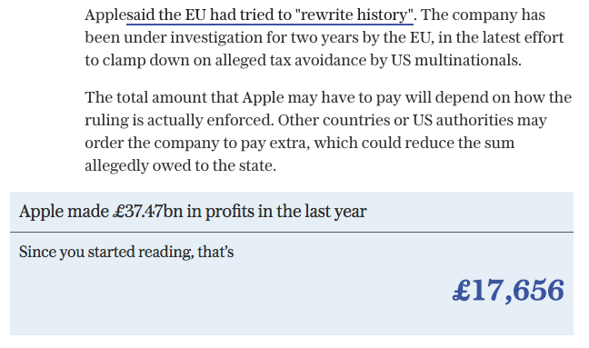

# Making a counter in JavaScript



Counters are hugely useful in storytelling. Firstly, they can be used to introduce a sense of *tension* - after all, what can be more dramatic than a countdown clock? But secondly, they can also be used to *illustrate* something. Saying that a sportsperson earns a certain amount per hour is one thing, but *showing* those earnings piling up by the second is much more effective. There's a reason why dramatists and writers say "Show, don't tell".

The data journalism outfit Ampp3d pioneered the use of counters in journalism, employing it in stories such as ‘Live counter: Watch how much NHS money is going into private hands’ (Cocco 2014), ‘Watch Wayne Rooney's earnings add up in real-time’ and ‘Watch how many foreigners enter the UK. Every. Single. Second.’ (now no longer online). The last example used multiple counters to illustrate how headline figures about the number of foreign visitors failed to mention that most of those visitors were tourists. While the counter for tourists moved quickly, the counter of migrants did not, because the numbers were much smaller. It was a clever way of putting figures into context.

Creating a counter also helps you to understand some of the mathematical functions in JavaScript, data types, and how to create your own function.

In this tutorial we will make two types of counter: firstly, the *illustrative* type which shows an amount changing in real time; and then, the *countdown* type which shows time. This second type brings some additional challenges that will be useful to explore separately.

## Interlude: code playgrounds

In this tutorial we're going to use a code 'playground'. These are online services where you can try out code and see the results in front of you. Two of the best known code playgrounds are [Codepen](https://codepen.io/), and [JSFiddle](https://jsfiddle.net/) - both are very similar, but it's the former that we're going to use here.

### Getting started with Codepen

Codepen [describes itself](https://codepen.io/about) as a "playground for the front end side of the web". It is a web-based tool that allows you to easily experiment with JavaScript and see results instantly. It also allows you to explore and 'fork' (clone and work on) code from other users, which you can find by using the search or browse facility, or stumbling across links elsewhere on the web or on Codepen's own blog.

Once you have registered for a free account on Codepen, click on **Create** and select **Pen**. A 'pen' is just what Codepen calls a simple project (the site also allows you to create 'projects', but we those are more complex and we don't need to make one here).

The default view for a pen splits the screen into four sections: three vertically across the top part of the screen, and a fourth running horizontally across the bottom.

The three vertical sections are labelled 'HTML', 'CSS' and 'JS' (JavaScript): as you might expect, the idea is that you write the HTML code in the 'HTML' window, the CSS in the window labelled 'CSS', and the JavaScript... yes, in the 'JS' window.

The fourth panel running across the bottom, then, shows a preview of how the resulting page looks and operates.


You can change the organisation of those panels, or switch to a full screen preview, by selecting from the **Change view** menu.

Coding with four panels has a number of advantages: instead of having to switch between three different files (the HTML file and the CSS and JS files that it links to) and a browser, all the work can be done on one screen.

It also saves on some of the basic steps in creating a HTML page or linking to those files - you don't need to create `<head>` or `<body>` tags, or write the lines of code linking to the CSS and JS files; those lines are automatically created for you, and included if you export your pen (more on this below).

Likewise, if you are building on work you have done previously (repeating certain steps, for example), you can 'fork' existing projects into new ones, copying all the code and settings across.

If you want to really show off, there are also [some helpful keyboard shortcuts](https://blog.codepen.io/documentation/editor/key-bindings/). Once you've opened a HTML tag, for example, you can automatically add a closing tag by pressing CMD+.+SHIFT on a Mac, or CTRL+.+SHIFT on a PC. To see other shortcuts, click the **keyboard** button towards the bottom left of the screen on Codepen.

## Breaking the problem down

Before writing any code, we need to break down our problem into separate challenges. For the illustrative counter, then, we need to:

* Display an initial number
* Calculate the amount of change per second (we'll assume it's per second, but you could use other time units)
* Change that initial number by that amount, every second

### Step 1: Display an initial number

[Watch a video walkthrough of this tutorial here](https://www.youtube.com/watch?v=TMCOSz1sy8o)

On our HTML page we need to create an element which the JavaScript can target. Because it's part of a sentence, rather than a number on its own, we'll use a `<span>` tag like so:

`<p>While you have been reading this, Apple has earned £<span id="money">0</span></p>`

When the sentence first loads, the number in that `span` is 0. But our function will soon change that.

### Step 2: Calculate the change per second

According to [our article](http://www.telegraph.co.uk/technology/2016/08/30/apple-ordered-to-pay-11bn-after-european-union-tax-investigation/), "Apple made £37.47bn in profits in the last year". We need to turn that annual figure into an amount per second.

First, as a figure £37.47bn is 37470000000.

Divide that by 365 to get a daily figure.

Divide the daily figure by 24 to get an hourly figure.

Divide the hourly figure by 60 to get an amount per minute.

Divide that by 60 again to get an amount per second.

Expressed as a calculation in JavaScript that would be:

```js
var annualTotal = 37470000000;
var amountPerSecond = annualTotal/365/24/60/60; //365 days, 24 hours, 60 minutes, 60 seconds
console.log("per second amount is "+amountPerSecond);
```

Or £1188.17 per second.

Writing the JS calculation like this is a better approach than simply calculating the per-second amount offline and then entering that as a variable. Why? Because when Apple's annual profits change you only need to change that variable and the rest of the code will still work.

### Step 3: Creating a timer counter

Now for the JavaScript that shows the money piling up. We already have our 'per-second' variable, but we also need to set a variable which will hold a running total - and then put it into our page:

```js
var runningTotal = 0
document.getElementById('money').innerHTML = runningTotal;
```

Next, we need a function which will increase that `runningTotal` by the `amountPerSecond`:

```js
function updateAmount(){
  console.log("updateAmount running");
  console.log(runningTotal);
  runningTotal = runningTotal+amountPerSecond;
  //insert runningTotal into page
  document.getElementById('money').innerHTML = runningTotal;
}
```

The function begins with a couple of `console.log`s, just so we can check that the function is running, and see the value held in `runningTotal`.

Next, we increase the `runningTotal` by the `amountPerSecond`. This is done by adding `runningTotal+amountPerSecond` and putting the result into `runningTotal`.

The first time that this function runs, that calculation will be `0+1188.17`. But because this line *changes* `runningTotal` to `1188.17`, the second time this function runs the calculation will be `1188.17+1188.17`, and the third time `2376.34+1188.17`, and so on.

Now that we have changed the variable, we also need to update the page to insert it into `<span="money">` again. Here we just use the same line we used to put it in the first time: `document.getElementById('money').innerHTML = runningTotal;`

That function will update the amount once - but we need it to *keep* updating, over and over again, every second.

One way to get it to keep updating would be to create a *loop*. For example, we could use a *for* loop to say 'for every number between 1 and 100, run this function'. Or we could use a *while* loop to say 'while this number is below 500000, run this function'.

The problem with those ideas, however, is that loops run extremely quickly - much faster than once every second.

What we need to, then, is to pause for a second before running the function a second time. [There are a number of ways to do this](https://developer.mozilla.org/en-US/Add-ons/Code_snippets/Timers): one is the `setInterval` method. It sounds right because it:

> "Calls a function or executes a code snippet repeatedly, with a fixed time delay between each call to that function."

It takes two ingredients: a function to run, and a length of time (in milliseconds) after each run. For example this code would run the function `updateAmount` every 1000 milliseconds:

`setInterval(updateAmount, 1000);`

That just needs to be placed *after* the function has been created, so it will start running then:

```js
function updateAmount(){
  console.log("updateAmount running");
  console.log(runningTotal);
  runningTotal = runningTotal+amountPerSecond;
  //insert runningTotal into page
  document.getElementById('money').innerHTML = runningTotal;
}
setInterval(updateAmount, 1000);
```

### The code in full

Once that has been done we should have all the basic code that we need. Here it is brought together, along with some explanatory comments:


```html
<p>While you have been reading this, Apple has earned £<span id="money">0</span></p>
<script>
var annualTotal = 37470000000; // total per year
var amountPerSecond = annualTotal/365/24/60/60; //365 days, 24 hours, 60 minutes, 60 seconds
console.log("per second amount is "+amountPerSecond);
var runningTotal = 0 // set a running total which will change

function updateAmount(){ //this function updates the runningTotal
  console.log("updateAmount running");
  console.log(runningTotal);
  runningTotal = runningTotal+amountPerSecond; //increase runningTotal
  document.getElementById('money').innerHTML = runningTotal; // display on page in HTML element with id="money"
}
setInterval(updateAmount, 1000); //run updateAmount function every 1000 milliseconds
</script>
```

Now the code works - but there's still some room for improvement.

### Improving the code

There are three things that we could improve immediately: rounding our figure to two decimal places; adding commas to make large numbers easier to understand; and optimising the unnecessarily complex the per-second calculation.

The first line to improve is that calculation: `var amountPerSecond = annualTotal/365/24/60/60`

Instead of chaining together four divisions, we could simply divide the total by one value: the number of seconds in a year.

There are [actually three values we could use for this](http://www.rapidtables.com/calc/time/seconds-in-year.htm): an astronomical year of 365.25 days has 31,557,600 seconds; a normal calendar year of 365 days has 31,536,000 seconds; and a leap year has 31,622,400 seconds.

Any one could be valid: if we were telling our story in a leap year we might use that value. Alternatively we could add some code to check whether this year is a leap year or not. But I want to keep this simple for now, and as the astronomical year is the safest option, I'm going to use that.

```js
var annualTotal = 37470000000;
var secondsInYear = 31557600; //based on astronomical year of 365.25 days
var amountPerSecond = annualTotal/secondsInYear
```

Now let's move on to the displaying of the figure.

Because we're talking about money, it makes no sense to display a figure that runs to more than two decimal places. So we need to find a way to round the number when it is displayed. The JavaScript method `toFixed()` is the way to do this: a quick search [tells us](https://www.w3schools.com/jsref/jsref_tofixed.asp) it "converts a number into a string, keeping a specified number of decimals".

The number of decimals to be kept is specified in the parentheses, like so: `toFixed(2)`.

There are a number of points at which we could do this. For example, we could apply this to the `amountPerSecond` variable, either when it is first set, or when it is added to `runningTotal`. If we did it there, however, we would have to remember to convert it back into a number using the `parseInt()` or `Number()` functions.

Instead, then, I'm going to do it at the point where the number is displayed on the page:

`document.getElementById('money').innerHTML = runningTotal.toFixed(2)`

This works well, but as the figures get larger and larger it becomes harder to distinguish between hundreds of thousands and millions. Adding commas would help, but how can we do that?

As is often the case, the quickest way to find out is to search for examples, using a phrase like "*formatting numbers in javascript with comma*". There are various examples of people asking this question on Stack Overflow.

One solution involves using **regex** - regular expressions - to identify a pattern in the value (three digits before a full stop, for example) and insert a comma when that pattern is matched. Here is one function [shared on such a thread](https://stackoverflow.com/questions/2901102/how-to-print-a-number-with-commas-as-thousands-separators-in-javascript) for that purpose:

```js
function numberWithCommas(x) {
    return x.toString().replace(/\B(?=(\d{3})+(?!\d))/g, ",");
}
```

It does work, and you could use this if you wanted. But...

Another solution involves [the `toLocaleString()` method](https://developer.mozilla.org/en-US/docs/Web/JavaScript/Reference/Global_Objects/Number/toLocaleString), which will convert a string in a format that makes sense in that location. This is even more useful because while countries like the UK and US use thousand separators, in countries like Spain they use a period instead.

Unfortunately it does not work with the `toFixed()` method (because that turns it into a string, and we need a number), so we have to remove that first, and then add `.toLocaleString()` instead:

```js
document.getElementById('money').innerHTML = runningTotal.toLocaleString();
```

The parentheses can be left empty - but they can also be used to add extra specifications about how we want to format this string, including the number of decimal places.

The [documentation on MDN](https://developer.mozilla.org/en-US/docs/Web/JavaScript/Reference/Global_Objects/Number/toLocaleString) includes some options and useful examples. Below is an example adapted from those to specify that we want to format the number as British currency, with a maximum of two decimal places:

 ```js
 document.getElementById('money').innerHTML = runningTotal.toLocaleString("en-GB",{maximumFractionDigits:2});
 ```

When incorporated into our code, it now looks like this:

```html
<p>While you have been reading this, Apple has earned £<span id="money">0</span></p>
<script>
var annualTotal = 37470000000;
var secondsInYear = 31557600; //based on astronomical year of 365.25 days
var amountPerSecond = annualTotal/secondsInYear
console.log("per second amount is "+amountPerSecond);
var runningTotal = 0 // set a running total which will change

function updateAmount(){ //this function updates the runningTotal
  console.log("updateAmount running");
  console.log(runningTotal);
  runningTotal = runningTotal+amountPerSecond; //increase runningTotal
  document.getElementById('money').innerHTML = runningTotal.toLocaleString("en-GB",{maximumFractionDigits:2}); // display on page in HTML element with id="money"
}
//now run the function updateAmount every 1000 milliseconds
setInterval(updateAmount, 1000);
</script>
```


### Sharing and exporting your webpage

You can share a pen in three main ways:

* By sharing a link to the full page preview of your pen
* By embedding your pen elsewhere - for example, within a webpage, story or blog post
* By exporting your pen and hosting it as a working webpage elsewhere

To find the link to the full page preview of your pen, switch to the full-screen preview view and copy that URL. This is just the same as the URL that you are using while editing the pen, but with the word `pen` in the URL replaced with `full`. This full screen version will still have a Codepen strip across the top with the title of the pen, the name of the author (you), and links to fork it or change the view.

If you want to embed your pen somewhere, click on the **Embed** option button in the lower right corner of your pen. This brings up a preview where you can choose which of the four elements in your pen (HTML, CSS, JS and the final result) to embed. For example, if you just want to embed the result without the underlying code, make sure that 'HTML', 'CSS' and 'JS' are all toggled off, so that only 'Result' is left on. Likewise if you wanted to embed a version which showed the end result next to your CSS, you would leave those two toggled on, and 'HTML' and 'JS' toggled off.

Once you're happy with the preview, at the bottom you will find code that you can copy and paste to embed that preview in a webpage: for a WordPress site choose the 'WordPress Shortcode' tab; for other pages where you have more control over the HTML you can try the other two options of 'iframe' and 'HTML (recommended)'.

The third option is to export your pen. To do this click on the **Export** option button in the lower right corner of your pen and choose **Export .zip**. This will download a zip file to your computer. When unzipped you will have a JS folder containing a file with your JavaScript (called 'index.js'), a CSS folder containing a CSS file called 'style.css', and a HTML file containing your HTML plus the lines needed to pull in the CSS and JS files too.

Finally the zip file will also contain a 'README.txt' and 'license.txt' file - these just contain information about where the pen was created, including the URL where the live version can be found. You don't need to do anything with these.

You can open the HTML file in any browser on your computer and see the same working webpage. Likewise, you can upload those files to the web somewhere (GitHub Pages is one useful solution which we'll explain later) and have a working webpage too. Note, however, that you will need to maintain the same file structure - with the 'style.css' file inside a folder called 'CSS' in the same place as 'index.html' - links within that HTML file will not work if you move anything around, so if you do decide to change the file structure you'll need to update any links between those files as well.

## Challenges

* How can you change the code on the money counter so that it update more often than every second?
