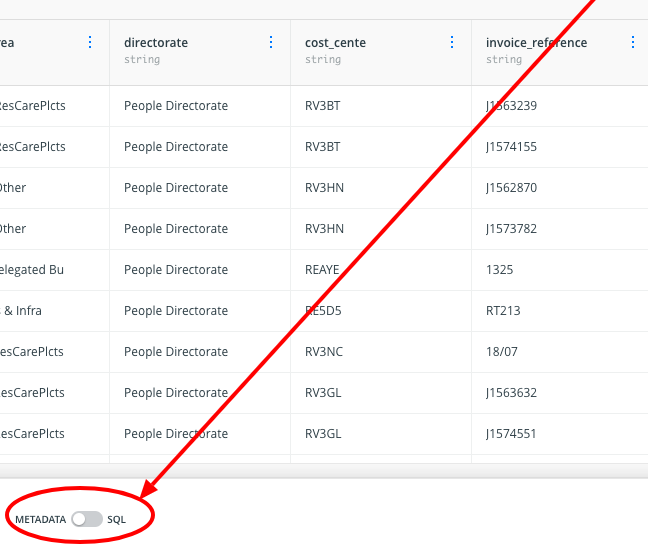
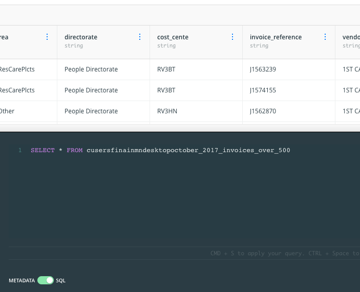
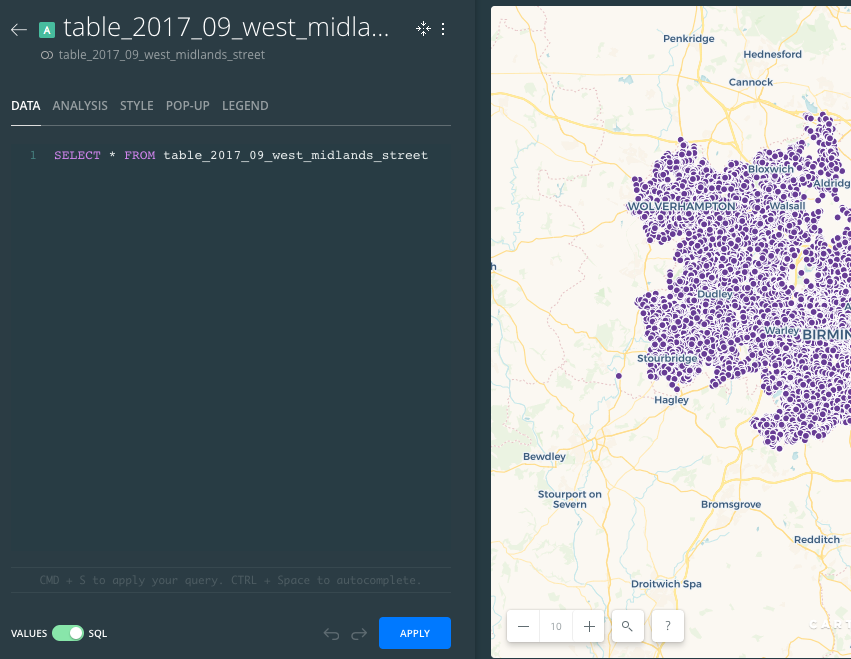
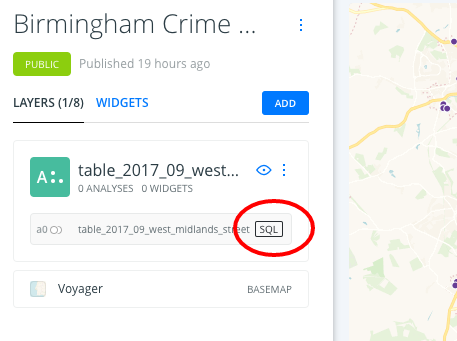

# Using SQL in Carto

The mapping tool Carto is a great way to learn about SQL (Structured Query Language). This guide explains how you can get started using SQL in Carto.

There are actually three ways to use SQL queries in Carto that I know of. These are:

* Applying SQL queries within a dataset
* Applying SQL queries in a map
* Using SQL to query your data using the Carto API

Before you begin, [download the latest expenditure data from here](https://data.birmingham.gov.uk/dataset/payments-to-suppliers-over-f500) (it should be at the bottom). I'll be using this for my examples.

## Applying SQL queries within a dataset

Here's a brief summary of the steps for the first:

1. Open Carto
2. Upload your dataset
3. Open the dataset
4. Toggle the switch at the bottom left from 'Metadata' to 'SQL'
5. Write your SQL query, and apply it
6. Create a map from the query if you want

Start by logging in and go to the 'datasets' section (there's a button in the upper right corner).

Click on *New dataset*.

Click on *Browse* and find the data.

Click *Connect dataset* to upload it.

After a moment you should be able to see the data. There might be some annoying empty columns but those can be ignored. Look out for columns that are in green (numbers) and those that aren't (text). This will affect the sorts of queries you can make against those columns (you can only sum and average number columns, for example)

Now, while inside your data, look at the bottom of the page for a toggle switch marked 'METADATA' and 'SQL'.

Click on that toggle switch to move it from METADATA to SQL. It should light up green and the bottom half of the screen should now show a dark area where you can type a SQL query:

In fact, a SQL query will already be there in that box. It will look something like this:

`SELECT * FROM cusersfinainmndesktopoctober_2017_invoices_over_500`

This means select all columns from the table with that name (this dataset).

You can now adapt this query to query your data in different ways. Notice that as you start typing a column name it will bring up a menu to make it easier for you to select the right name. Here is one example of a query which generates a pivot table of invoice totals by directorate:

`SELECT directorate, sum(invoice_amount) FROM cusersfinainmndesktopoctober_2017_invoices_over_500 group by directorate order by sum(invoice_amount) desc`

Of course, you can't map this data because it's not about locations. So try the same process with crimes data downloaded from [data.police.uk/data/](https://data.police.uk/data/).

This time you need to retain the latitude and longitude, so we are selecting all the columns, but filtering to see just one type of crime:

`select * from table_2017_09_west_midlands_street_1 where crime_type = 'Anti-social behaviour'`

Click **CREATE MAP** to see *just those crimes* shown.

## Applying SQL queries within a map

If you've already created a map and want to create a SQL query from within there, you just need to go into the data *within* the map.

First go into your Carto *maps* view and open the map. Once opened, the map should occupy the right two thirds of the screen, but the left third of the screen should contain a list of all the layers of that map (you may have only one).

Click on the layer containing the data you want to query.

That left area should now change to show 'STYLE' - one of 5 tabs including 'DATA', 'ANALYSIS', 'POP-UP' and 'LEGEND'.

Click on the 'DATA' tab.

At the bottom of this left hand area you should now be able to see a toggle switch with *VALUES* and *SQL*. Click on that to toggle it to SQL.

Once again, when toggled it will turn green and that area of the screen will turn dark. A ready-made SQL query will also be in this window that you can start to adapt:

Change that query to:

`select * from table_2017_09_west_midlands_street_1 where crime_type = 'Anti-social behaviour'`

And you will only see the crimes shown that match the query.

Click **APPLY** to apply it.

Now you can leave the data window and the query should still be applied. Note that when you are looking at your map again you should now see a 'SQL' box on the layer where you queried it.

## Advanced

Here's an example query for that which is quite fancy:

`SELECT concat(latitude, longitude) as latlong, latitude, longitude, count(*) FROM table_2017_09_west_midlands_street_1 group by latlong order by count(*) desc`

This query actually creates a new 'column' of data. This new column is a combination of latitude *and* longitude, and it is created by the section `concat(latitude, longitude) as latlong`. The `concat` command *concatenates* (combines) two pieces of text into one. That combination needs to have its own name, so `as latlong` gives it the name 'latlong'.

Once named, that name can be used later in the query, where it says `group by latlong`
